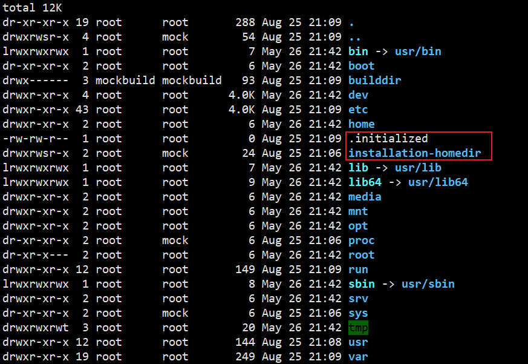
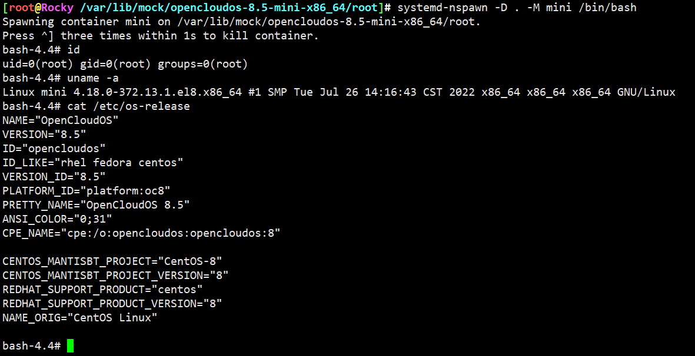
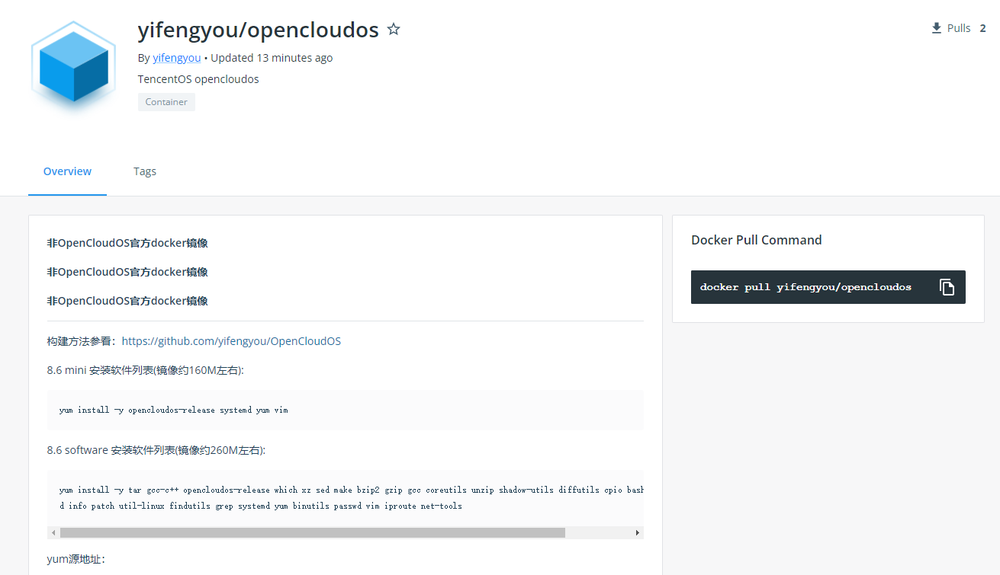
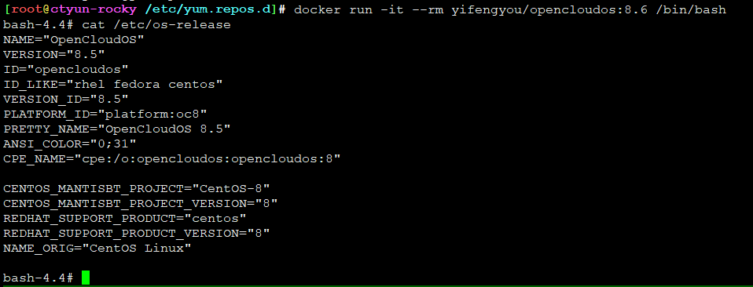
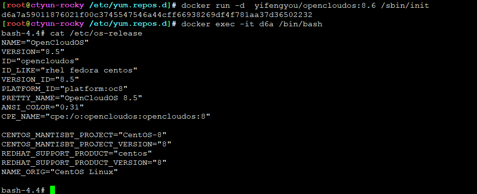
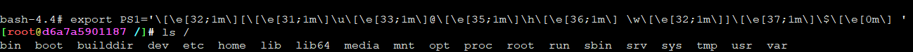

# opencloudos-8.5-x86_64

## mock配置

**/etc/mock/opencloudos-8.5-x86_64.cfg**

```
config_opts['root'] = 'opencloudos-8.5-x86_64'
config_opts['target_arch'] = 'x86_64'
config_opts['legal_host_arches'] = ('x86_64',)
config_opts['useradd'] = '/usr/sbin/useradd -m -u {{chrootuid}} -g {{chrootgid}} -d {{chroothome}} {{chrootuser}}'


config_opts['chroot_setup_cmd'] = 'install tar gcc-c++ opencloudos-release which xz sed make bzip2 gzip gcc coreutils unzip shadow-utils diffutils cpio bash gawk rpm-build info patch util-linux findutils grep systemd yum binutils passwd vim iproute net-tools'
config_opts['dist'] = 'oc8'
config_opts['macros']['%dist'] = '.oc8'
config_opts['releasever'] = '8'
config_opts['package_manager'] = 'dnf'
config_opts['extra_chroot_dirs'] = [ '/run/lock', ]
config_opts['description'] = 'OpencloudOS 8.5'

config_opts['dnf.conf'] = """
[main]
keepcache=1
debuglevel=2
reposdir=/dev/null
logfile=/var/log/yum.log
retries=20
obsoletes=1
gpgcheck=0
assumeyes=1
syslog_ident=mock
syslog_device=
metadata_expire=0
mdpolicy=group:primary
best=0
install_weak_deps=0
protected_packages=
module_platform_id=platform:el8
user_agent={{ user_agent }}

# OpenCloudOS.repo
#
# Author: OpenCloudOS <infrastructure@opencloudos.tech>
#
[BaseOS]
name=OpenCloudOS $releasever - Base
baseurl=http://mirrors.opencloudos.tech/opencloudos/$releasever/BaseOS/$basearch/os/
gpgcheck=0
enabled=1
gpgkey=file:///etc/pki/rpm-gpg/RPM-GPG-KEY-OpenCloudOS

[AppStream]
name=OpenCloudOS $releasever - AppStream
baseurl=http://mirrors.opencloudos.tech/opencloudos/$releasever/AppStream/$basearch/os/
gpgcheck=0
enabled=1
gpgkey=file:///etc/pki/rpm-gpg/RPM-GPG-KEY-OpenCloudOS

[Extras]
name=OpenCloudOS $releasever - Extras
baseurl=http://mirrors.opencloudos.tech/opencloudos/$releasever/Extras/$basearch/os/
gpgcheck=0
enabled=1
gpgkey=file:///etc/pki/rpm-gpg/RPM-GPG-KEY-OpenCloudOS

[HighAvailability]
name=OpenCloudOS $releasever - HighAvailability
baseurl=http://mirrors.opencloudos.tech/opencloudos/$releasever/HighAvailability/$basearch/os/
gpgcheck=0
enabled=1
gpgkey=file:///etc/pki/rpm-gpg/RPM-GPG-KEY-OpenCloudOS

[PowerTools]
name=OpenCloudOS $releasever - PowerTools
baseurl=http://mirrors.opencloudos.tech/opencloudos/$releasever/PowerTools/$basearch/os/
gpgcheck=0
enabled=1
gpgkey=file:///etc/pki/rpm-gpg/RPM-GPG-KEY-OpenCloudOS

[ResilientStorage]
name=OpenCloudOS $releasever - ResilientStorage
baseurl=http://mirrors.opencloudos.tech/opencloudos/$releasever/ResilientStorage/$basearch/os/
gpgcheck=0
enabled=1
gpgkey=file:///etc/pki/rpm-gpg/RPM-GPG-KEY-OpenCloudOS

# OpenCloudOS-Sources.repo
#
# Author: OpenCloudOS <infrastructure@opencloudos.tech>
#
[BaseOS-source]
name=OpenCloudOS $releasever - Base-source
baseurl=http://mirrors.opencloudos.org/opencloudos/$releasever/BaseOS/Source/
gpgcheck=0
enabled=1
gpgkey=file:///etc/pki/rpm-gpg/RPM-GPG-KEY-OpenCloudOS

[AppStream-source]
name=OpenCloudOS $releasever - AppStream-source
baseurl=http://mirrors.opencloudos.org/opencloudos/$releasever/AppStream/Source/
gpgcheck=0
enabled=1
gpgkey=file:///etc/pki/rpm-gpg/RPM-GPG-KEY-OpenCloudOS

[Extras-source]
name=OpenCloudOS $releasever - Extras-source
baseurl=http://mirrors.opencloudos.org/opencloudos/$releasever/Extras/Source/
gpgcheck=0
enabled=1
gpgkey=file:///etc/pki/rpm-gpg/RPM-GPG-KEY-OpenCloudOS

[HighAvailability-source]
name=OpenCloudOS $releasever - HighAvailability-source
baseurl=http://mirrors.opencloudos.org/opencloudos/$releasever/HighAvailability/Source/
gpgcheck=0
enabled=1
gpgkey=file:///etc/pki/rpm-gpg/RPM-GPG-KEY-OpenCloudOS

[PowerTools-source]
name=OpenCloudOS $releasever - PowerTools-source
baseurl=http://mirrors.opencloudos.org/opencloudos/$releasever/PowerTools/Source/
gpgcheck=0
enabled=1
gpgkey=file:///etc/pki/rpm-gpg/RPM-GPG-KEY-OpenCloudOS

[ResilientStorage-source]
name=OpenCloudOS $releasever - ResilientStorage-source
baseurl=http://mirrors.opencloudos.org/opencloudos/$releasever/ResilientStorage/Source/
gpgcheck=0
enabled=1
gpgkey=file:///etc/pki/rpm-gpg/RPM-GPG-KEY-OpenCloudOS
"""
```

## 使用mock制作rootfs

```
su - mockbuild -c "mock -r opencloudos-8.5-x86_64 init"

```

mock构建的rootfs在```/var/lib/mock/opencloudos-8.5-x86_64/root```路径下



这两个文件可以移除


## 制作docker镜像

可以用systemd-nspawn启动进去变更rootfs，当然也可以不，纯净版



```
cd /var/lib/mock/opencloudos-8.5-x86_64/root
tar -c . | docker import - yifengyou/opencloudos:8.6
```

```
docker tag yifengyou/opencloudos:8.6 yifengyou/opencloudos:latest
docker tag yifengyou/opencloudos:8.6 yifengyou/opencloudos:8.6-20220825
```


## 推送dockerhub

```
docker push yifengyou/opencloudos:latest
docker push yifengyou/opencloudos:8.6
docker push yifengyou/opencloudos:8.6-20220825
```

* <https://hub.docker.com/r/yifengyou/opencloudos>




## 运行

* 直接bash启动



* systemd启动



这里bash为什么“光秃秃”，因为没有做任何变更，莫有PS1变量



```
export PS1='\[\e[32;1m\][\[\e[31;1m\]\u\[\e[33;1m\]@\[\e[35;1m\]\h\[\e[36;1m\] \w\[\e[32;1m\]]\[\e[37;1m\]\$\[\e[0m\] '
```


---
